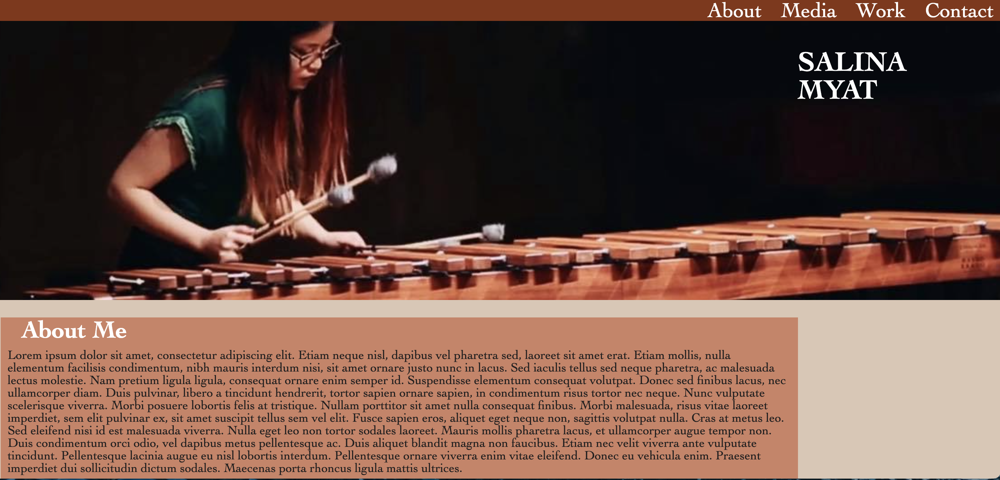
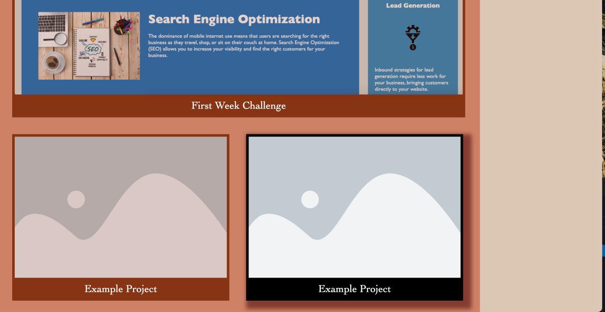

# Portfolio

The purpose of this project was to design and interactive website that allows viewers to engage with me and my work.

Things that I learnt to use during this project:
- effectively use pseudo-classes to make a page more dynamic and interactive
- how to better organise HTML and CSS sheets semantically, as well as comprehensively comment the code
- how to use new attributes such as ":mailto" and "target" to open pop-ups with links.

Deployment link: https://slingshort.github.io/Portfolio/

Example Images attached:

This is an example of the site at face-value

This demonstrates responsiveness when cursor is hovering over an element